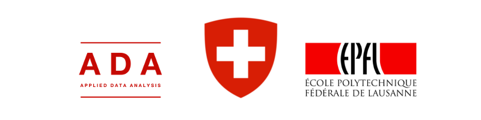

# parliament-viz.ch
(ADA CS-401 EPFL)

[Gael Lederrey](https://github.com/glederrey), [Jonas Racine](https://github.com/jonasracine) and [Joachim Muth](https://github.com/jmuth)

The current drafts of visualizations are available on website:
  * [Draft 1](http://178.62.67.149)
  * [Draft 2](http://178.62.67.149/parl/parliament.html)

## Similar Project

A project about predictions on the same data exists [here](https://github.com/thom056/ada-parliament-ML). 

It is possible that, in the future, both teams will work together. 

## Abstract

> The Freedom of Information Act came into force on 1 July 2006. It is intended to promote transparency with 
> regard to the purpose, organisation and activities of the federal administration, while guaranteeing access to 
> official documents produced after 1 July 2006.
>- [Swiss Parliament Website](https://www.parlament.ch/en/services/freedom-of-information-act)

The motivation for this project comes from the gulf existing between the political world and citizens. Even though all the information
is freely accessible on the official website of the Swiss Parliament, it amounts to a substantial number of papers and is hard to understand. Grabbing 
all the official 
bulletins produced during national assemblies, we will provide a clear and understandable summary of what main subjects are being
discussed during each session, who are the speakers and which party are they affiliated with. This summary will be presented as a D3 data visualization tool, and will be accessible through a web page.

## Data description
The whole data schema is accessible through [metadata web page](https://ws.parlament.ch/odata.svc/$metadata).

*This is a first look at the data, and will become far more precise as we work through it.*

### Official bulletins

[Official website of Swiss parliament - Official bulletins](https://www.parlament.ch/en/ratsbetrieb/suche-amtliches-bulletin)

Type of Procedure:        |
---------------------------
Question hour             |
Canton Initiative         |
Parliament Initiative     |
Interpellation            |
Motion                    |
Federal Council Object    |
Parliament Object         |
Postulate                 |
Petition                  |
Question                  |
Urgent Question           |

Each procedure can go though different debate:                  |     *details*
----------------------------------------------------------------| ----------------------------------------------------------
Advice (Rat)                | *First Advice*
                            | *Second Advice*
Differences (Differenzen)   | *Main debate*
Continuation (Fortsetzung)  | *Delayed debate*
Vote (Abstimmung)           |

Official bulletins contains:                      |     *details*
--------------------------------------------------|--------------------------------
Subject                                           |
Date                                              |
Kind of parliamentary chamber                     | *Council of States (46 deputies: cantons-equitable)*
                                                  | *National Council (200 deputies: proportional to canton population)*
                                                  | *United Federal Assembly (both unified)*
Course of Debate                                  | *List of speakers (+ canton and political party)*                       
Full speeches of all speakers                     |

### Session briefings
[Official website of Swiss parliament - Session briefings](https://www.parlament.ch/en/ratsbetrieb/sessions/overview-briefings)

The briefings are PDF summaries of all objects debated during parliamentary sessions. Could be a good starting point to create a frame of
our project.

## Feasibility and Risks

#### Parliamentary Terms
Complicated and precise terminology, specific to the political area.
[Lexicon of Parliamentary Terms](https://www.parlament.ch/en/über-das-parlament/parlamentswörterbuch)

#### Three official languages
Speakers debate in their own language, mainly in German and French. Textual analysis must take care not to lose information
by translating them into English.

#### Licences
[Open Data / Web services statement of Parliament website](https://www.parlament.ch/en/services/open-data-webservices)
The provided information can be freely used, under reasonable conditions (no alterations, source indicated, 
date of download indicated).

#### Data collecting
The data is available via API [here](https://ws.parlament.ch/odata.svc/$metadata)

#### Theme classification
Official bulletins don't contain clear *topic* attribute. The names of debated object do not always state clearly what they cover.
We will use NLP tools on speeches in order to extract their theme.

#### Visualization
The objective of the visualization is to show the importance of the different topics discussed in the parliament. To accomplish that, it must merge different points of view: frequency of the topic, evolution over time, importance compared to other subjects, diversity of speakers participating in the topic.

A big part of the project will be spent on how to visualize all these parameters. 

Source of inspiration : [legex timeline](http://www.legex.org/timeline/index.html#legislation=all&chamber=all&party=all&committee=all&majority=all&gender=all&state=all&outcomes=all&topics=all&view=total&zoomed=false&graphbar=false&relative=false)

#### Website hosting
The website will be deployed on [GitHub Pages](https://pages.github.com) and accessible through EPFL domain name.

#### Automation task
The task of grabbing, parsing, sorting and adding the data to our database (i.e. to our website since we will use D3) will be completely automated to allow future automatic updates each time a parliamentary session opens.

#### Data-Driven Documents
The D3 javaScript library will allow us to design a clean and interactive visualization. [D3 website](https://d3js.org)

## Deliverables 

The final product will take the form of an online website presenting different interactive visualization of Swiss Parliament data. This website will be hosted on github. These interactive visualizations will be built with the d3.js library

Visitors will be able to see the evolution of frequencies of specific themes in chronologic order. They will also be able to focus on the importance of one theme within each session. Visitors will be able to focus on one speaker or one political party to see their preferred subjects and their evolution in time.

## Timeplan

  - **November 6th, 2016**: Start of the project ✔
  - **November 13th, 2016**: Data scraping and parsing of a first usable dataset ✔
  - **November 27th, 2016**: Content extraction of the official bulletins using NLP tools (speaker, themes, ...) ✘ 
  - [UPD] Topics will be extracted from tags
  - **December 11th, 2016**: First interactive data visualization (local hosted) ✔
  - **Mid-December, 2016**: Checkpoint ✔
  - **January 1st, 2017**: Growing of the database
  - [ADD] Distinction between speeches as reporter and questions in participation scale.
  - [ADD] Focus on initiatives and interventions.
  - [ADD] Friendship though co-signatures.
  - **January 15th, 2017**: website design for user-friendly visualization
  - **January 31th, 2017**: Final deadline

## Acknowledgements
A warm thank you to **Alain Rebetez**, political journalist, and **Philippe Nantermod**, PLR deputy at National Council, for their expertise in Swiss parliamentary system and their external point of view about the project.

